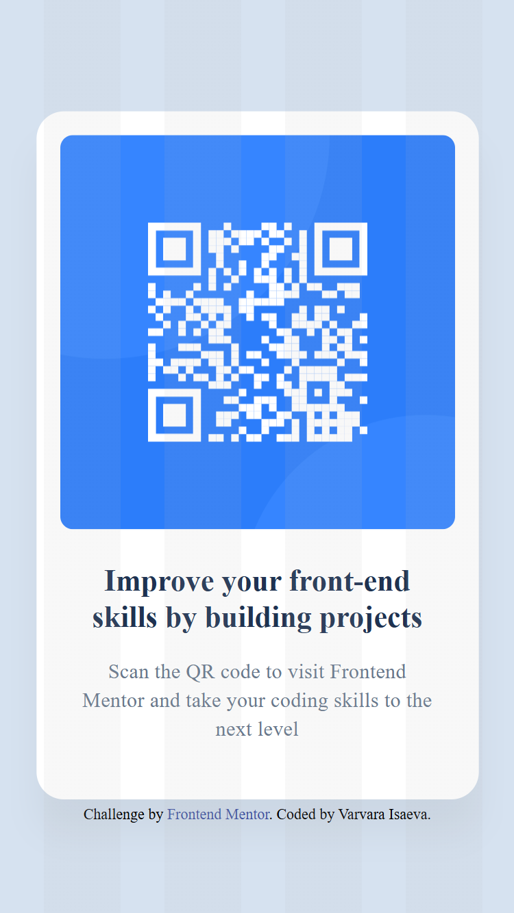

# Frontend Mentor - QR code component solution

This is a solution to the [QR code component challenge on Frontend Mentor](https://www.frontendmentor.io/challenges/qr-code-component-iux_sIO_H). Frontend Mentor challenges help you improve your coding skills by building realistic projects. 

## Table of contents

- [Overview](#overview)
  - [Screenshot](#screenshot)
- [My process](#my-process)
  - [Built with](#built-with)
  - [What I learned](#what-i-learned)
  - [Continued development](#continued-development)
- [Author](#author)

## Overview

### Screenshot



The gradient background is based on the Figma design for the task. There is no gradient in the design images in the project folder. However, I enjoy solving problems, so here we are.

## My process

### Built with

- Semantic HTML5 markup
- CSS custom properties
- Flexbox
- Responsive design
- [CSS docs](https://developer.mozilla.org/en-US/docs/Web/CSS)

### What I learned

It's not my first project in HTML, so I didn't learn much. But I did learn how to create repetitive linear gradients and refresh my skills working with clean HTML without frameworks. I found this experience quite interesting and useful.

Repetitive linear gradients:

```css
background: repeating-linear-gradient(
    to right,
    transparent 0,
    transparent 32px,
    rgba(184, 184, 184, 0.1) 32px,
    rgba(184, 184, 184, 0.1) 88px
    );
```

### Continued development

Currently, all my work experience is based on the Vue framework. I want to learn how to use React, which is why I decided to use Frontend Mentor.

## Author

- LinkedIn - [Varvara Isaeva](https://www.linkedin.com/in/varvara-isaeva-388421332/)
- Frontend Mentor - [@SmartBlondie](https://www.frontendmentor.io/profile/SmartBlondie)
- GitHub - [@SmartBlondie](https://github.com/SmartBlondie)